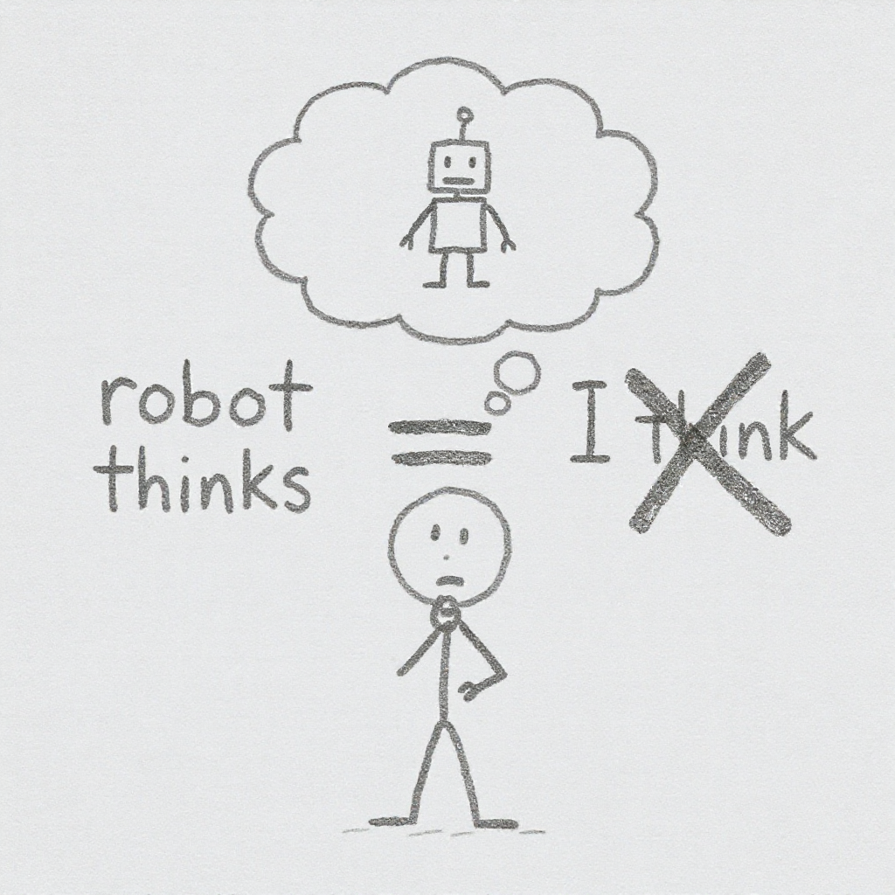
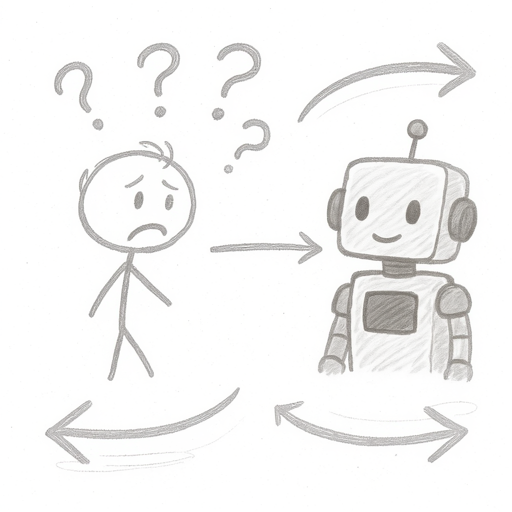
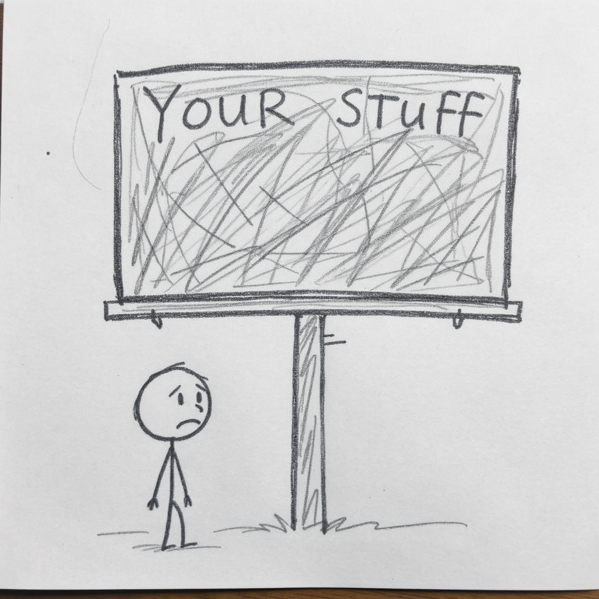
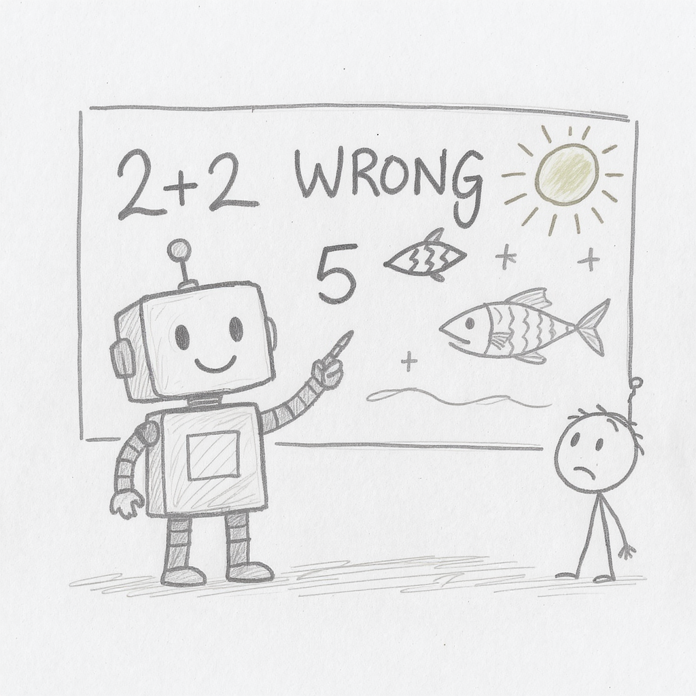
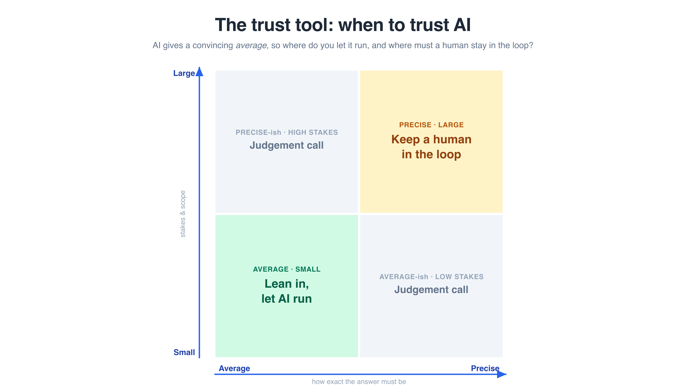

## {background-color="black"}

{fig-align="center"}

::: {.incremental}
- **$440,000** paid to Deloitte for an AI-generated welfare report
- It contained **fabricated citations** — fake studies, made-up quotes
- Reputation built over decades — damaged in days
:::

::: {.notes}
Pause for 2-3 seconds before speaking.

"$440,000. That's what the Australian government paid Deloitte for a welfare review report earlier this year. Reports contained fabricated citations. Canada had a similar incident — $1.6 million healthcare report with incorrect citations. Their reputation — built over decades — damaged by AI-generated misinformation they didn't verify. Today, I'm going to teach you how to use AI as a strategic thinking partner — and how to avoid becoming the next headline."
:::

## Follow Along: The Companion Site {.center}

<br>

{width=380 fig-align="center"}

`michael-borck.github.io/mgmt1003`

<br>

> **Everything from today lives here** — every prompt, the handout, the Trust Tool game.

Scan now — you'll use it after each demo.

::: {.notes}
Give the room 30-45 seconds to scan. This is the handout — nobody needs to copy code off slides; every prompt we run today is at the top of that site, ready to paste. The QR is also on the title slide if they missed it, and we'll come back to it at the end.
:::

## Today's Session

1. **The AI Mindset** — Conversation, not delegation
2. **RTCF Framework** — Structure better prompts
3. **Board of Directors** — Live demo
4. **Devil's Advocate** — Live demo
5. **The Human Edge** — Your voice, live demo
6. **VET Framework** — Verify everything

**Companion Website:** link in chat — QR on the next slide.

::: {.notes}
The core theme today has two halves: think WITH AI, not THROUGH AI — and the conversation IS the thinking. But the destination is the human edge: when everyone has AI, the differentiator is what only you bring. Reverse Prompting and more prompts are on the companion site.
:::

## The Real Problem {.center}

:::: {.columns}

::: {.column width="50%"}
### Delegation Mindset

- "Write me a business plan"
- "Give me the answer"
- Copy-paste the output
- Hope it's correct
:::

::: {.column width="50%"}
### Conversation Mindset

- "Help me think through this"
- "What am I missing?"
- Iterate and refine together
- Verify and own the result
:::

::::

::: {.notes}
Most people treat AI like a vending machine — put in a prompt, get an answer. That's delegation. What we want is conversation — a back-and-forth where AI helps you think better.
:::

## Conversation, Not Delegation {.center}

<br>

> AI should **challenge your thinking**, not replace it.

<br>

**Conversation IS thinking.** The draft is just the record of it.

Your job is **Editor-in-Chief**, not stenographer.

::: {.notes}
This is the single most important idea from today, and it has two halves. First: think WITH AI, not THROUGH AI. Second — the deeper point — the conversation itself is where the thinking happens. Delegate the thinking and you get an answer you never earned and can't defend. Converse, and the thinking sticks. The document you hand in is just the record of the conversation.
:::

## AI is a Smart Intern

{fig-align="center" height=350}

::: {.incremental}
- AI is a **reasoning engine**, not a search engine
- It doesn't "know" things — it predicts likely responses
- Brilliant, fast, eager... but will confidently make things up
:::

::: {.notes}
Google finds information that exists. AI generates responses based on patterns. Think of AI like a brilliant intern — eager, fast, amazing work, but might confidently present completely made-up statistics.
:::

## The Golden Rule

{fig-align="center" height=350}

> The moment you stop questioning AI's output is the moment you become Deloitte.

::: {.notes}
AI should challenge your thinking, not replace it. Your role is Editor-in-Chief, not stenographer. Always question, always verify.
:::

## RTCF Framework {.center}

:::: {.columns}

::: {.column width="25%"}
### Role
Tell AI **who** to be

*"Act as a CFO..."*
:::

::: {.column width="25%"}
### Task
Tell AI **what** to do

*"Analyse this idea..."*
:::

::: {.column width="25%"}
### Context
Give **background**

*"For a university market..."*
:::

::: {.column width="25%"}
### Format
Specify **output**

*"Give me 3-4 bullet points..."*
:::

::::

<br>

Better prompts = better conversations

::: {.notes}
RTCF gives you a simple structure for any prompt. You don't need all four every time, but the more context you give, the better the response. This is the difference between "write me a marketing plan" and a genuinely useful conversation.
:::

## Part 1: The AI Mindset

{fig-align="center"}

::: {.notes}
Transition to the first technique. We've covered the mindset — now let's put it into practice. Two live techniques, then the voice test.
:::

## Board of Directors Strategy

{fig-align="center" height=400}

Get **multiple expert viewpoints** in one prompt — catches blind spots you'd miss thinking alone.

::: {.notes}
The concept: CFO perspective (financial), Marketing Director (customers), Operations Manager (practical), Legal Counsel (compliance). Why it works: catches blind spots you'd miss thinking alone.
:::

## Demo: Board of Directors Prompt

```
I'm considering opening a cashless coffee shop
near a university campus.

Act as my board of directors and analyse this
idea from multiple perspectives:

1. As CFO: Financial considerations, risks, ROI?
2. As Marketing Director: Positioning and reach?
3. As Operations Manager: Practical challenges?
4. As Legal Counsel: Regulations to consider?

For each perspective, give me 3-4 key points.
```

::: {.notes}
Switch to browser and run this demo in Gemini. After the demo, encourage students to try with their own business idea — meal prep delivery, tutoring app, sustainable fashion rental, or their own idea.
:::

## Devil's Advocate — Overcoming Confirmation Bias

{fig-align="center" height=400}

Force AI to argue **against** your position — key phrases: *"Be harsh but fair"*, *"Don't hold back"*

::: {.notes}
The problem: we look for evidence that supports our ideas. The solution: force AI to argue against your position. Giving AI permission to be critical produces better feedback.
:::

## Demo: Devil's Advocate Prompt

```
I believe that a cashless coffee shop near
a university is a great business idea.

Play devil's advocate. Give me the strongest
possible arguments against this idea.
Be harsh but fair. I want to know:

1. Why might this fail?
2. What am I probably not thinking about?
3. Who would this NOT work for?
4. What market conditions could kill this?

Don't hold back - I need to hear the hard truths.
```

::: {.notes}
Switch to browser and run this demo. Point out how giving AI permission to be critical produces better feedback.
:::

## The Human Edge {.center}

<br>

> AI can write a book. It **cannot write the next bestseller**.

::: {.incremental}
- Bestsellers aren't just well-written — they carry a **person**: lived experience, taste, timing, voice
- If AI can produce it, **everyone can produce it** — the average is now free
- So: what makes **your** submission different?
:::

::: {.notes}
The question that decides your grades — and your careers. AI can write a competent novel: plot, prose, structure. It cannot write the next bestseller, because a bestseller is a human artifact — lived experience, taste, an author's voice, cultural timing. Nobody can prompt their way to it. Same for your work. AI can produce the essay, the report, the pitch. So can every other student in this room. Your marker reads 200 papers — the ones that stand out are the ones with YOU in them: your example, your data, your reasoning, your voice. Using AI is fine. Submitting the average is what costs you.
:::

## Demo: The Voice Test — Pass 1 (Generic)

```
Write a 60-word social media promo for a cashless
coffee shop near a university campus.
```

::: {.notes}
Switch to browser and run this in Gemini — the same chat as the Devil's Advocate demo, so the thread stays alive. Watch it produce slick, forgettable marketing-speak: "elevate your coffee experience", "your ultimate study destination". Could be any café, anywhere. This is the average — and the average is free.
:::

## Demo: The Voice Test — Pass 2 (Your Voice)

```
Here is ~100 words of my own writing:

"Real talk — I've started about six group assignments this
year and every one begins the same way. Five names on a doc,
a group chat that's electric for about four hours, then
silence for two weeks. Then the panic message: 'hey guys,
so what are we actually doing?' I've stopped being precious
about it. First 20 minutes, someone writes a rough plan,
everyone claims a bit, nobody's bit is precious. Finished
beats perfect. Every assignment where we aimed for perfect
ended in an extension application. The ones where we aimed
for finished? Submitted early, went to the pub."

Now write the same 60-word promo for the cashless coffee
shop — but in my voice.
```

::: {.notes}
Run this in the same chat. Same model, same ask — the ONLY difference is 100 words of me, about something completely unrelated to coffee. Watch it pick up the rhythm: short sentences, the dry asides, "finished beats perfect" energy. Be honest with the room: it's still a bit AI-ish, a bit janky — but it sounds like a person, not a brand. And notice what it did NOT do: it didn't steal my ideas — group assignments have nothing to do with coffee. It borrowed my voice. Voice is yours to supply; only you have it. For assignments: your marker reads 200 AI-average essays that all sound identical. Yours shouldn't.
:::

## Reverse Prompting — When You Don't Know What to Ask

{fig-align="center" height=350}

Let AI **interview you** first — recommendations become tailored, not generic.

**Full prompt on the companion site.**

::: {.notes}
Quick one — no live demo. Sometimes the hardest part is knowing what questions to ask. Flip it: tell AI to interview YOU, one question at a time, before giving advice. Great for assignment planning, job interviews, business plans. Full prompt is on the companion site — try it tonight on your next assignment. Notice this is "conversation is thinking" in action: the interview itself clarifies what you actually want.
:::

## The Billboard Rule

{fig-align="center" height=350}

> Before sharing anything with AI, ask: **"Would I be comfortable if this appeared on a billboard?"**

Never share: passwords, personal info about others, confidential data

::: {.notes}
This is your privacy filter. AI conversations may be used for training. Treat every prompt as potentially public.
:::

## The Hallucination Trap

{fig-align="center" height=350}

::: {.incremental}
1. **AI doesn't know it's lying** — it generates plausible text
2. **Confidence ≠ Accuracy** — sounds equally confident right or wrong
3. **Pattern matching, not truth** — predicts likely responses
:::

::: {.notes}
Remember Deloitte? This is why it happened. AI generates plausible text, it doesn't verify facts. It sounds equally confident whether it's right or wrong.
:::

## VET Framework — Verify Everything {.center}

:::: {.columns}

::: {.column width="33%"}
### Verify
Can you **find this source** independently?

*Search for the claim yourself*
:::

::: {.column width="33%"}
### Explain
Can AI **explain its reasoning**?

*Ask "why?" and "how do you know?"*
:::

::: {.column width="33%"}
### Test
Does it **make logical sense**?

*Cross-check with other tools*
:::

::::

<br>

If you can't verify it, **don't use it**.

::: {.notes}
VET replaces the old "three verification questions" with a memorable framework. Verify: find the source independently. Explain: ask AI to show its reasoning. Test: cross-check with other tools and your own logic. If you can't verify it, don't use it.
:::

## The Trust Tool — Two Questions Before You Act {.center}

Ask them **before** you act on any AI output — not after:

:::: {.columns}

::: {.column width="50%"}
### 1. Precision

Does this need to be **precise** — or is **average** fine?

*A brainstorm can be average. A number someone acts on must be precise.*
:::

::: {.column width="50%"}
### 2. Blast radius

If it's wrong, is the damage **small** or **large**?

*A typo in a draft is small. A wrong recommendation that spreads is large.*
:::

::::

::: {.notes}
Two questions, not one. "Is this AI output correct?" is the wrong question — it has a different answer for every task. Ask instead: how exact must the answer be, and how big is the blast radius if it's wrong? A brainstorm can be average; a contract figure, a citation, a number someone acts on must be precise. Next slide: what those two answers tell you to do.
:::

## The Trust Tool — The Grid {.center}

{fig-align="center" height=470}

**Practise:** the Trust Tool game — on the companion site.

::: {.notes}
Bottom-left: average and small stakes — lean in, let AI run. Top-right: precise and large stakes — a human stays in the loop; AI is a first draft only. The off-diagonals are judgement calls — verify before you ship. Deloitte, in one line: the top-right corner treated as the bottom-left. The model didn't fail uniquely — the placement failed. Almost every public AI failure is a top-right output treated as bottom-left. For assignments: your references and figures are top-right — verify those before anything else. The interactive game on the companion site serves up scenarios to place on the grid — try it tonight.
:::

## Free AI Tools You Can Use Today

| Tool | Free Limit | Best For |
|---|---|---|
| **Gemini Notebook** | Generous | Source-grounded research, no hallucination |
| **ChatGPT** | ~10 msgs / 5 hrs | General brainstorming and analysis |
| **Claude** | ~15 msgs / 5 hrs | Detailed writing and reasoning |
| **Gemini** | ~5 prompts / day | Google Workspace integration |
| **Grok** | 10-15 / 2 hrs | Fast reset cycle, frequent use |
| **Meta AI** | Free, no sign-up | Quick questions, Llama 4 models |

::: {.notes}
You don't need a paid subscription. Spread your prompts across multiple free tools. Gemini Notebook is your workhorse — upload sources, no hallucination, generous limits. Free limits change frequently — check the handout for latest details.
:::

## {background-color="black"}

{fig-align="center" height=300}

::: {.incremental}
1. AI is a **conversation partner** — the conversation *is* the thinking
2. Use **RTCF** to structure better prompts
3. Get **multiple perspectives** (Board) and **invite criticism** (Devil's Advocate)
4. Your **voice and judgement** are the edge — don't submit the average
5. **VET everything** — verify, explain, test
6. **Place every task on the trust tool** — average/precise × small/large
:::

::: {.notes}
Recap the key messages. Emphasise: conversation over delegation — and the conversation is the thinking. When everyone has AI, the human edge — your context, your voice, your judgement — is the differentiator. VET your claims, and place your tasks on the trust tool so you know how much checking each one deserves. These techniques work with any AI tool.
:::

## Questions?

{fig-align="center" height=300}
{fig-align="center" height=150}

::: {.notes}
Resources available: all prompts from today's session, free AI tools handout, Style Mirror tool, the Trust Tool game, deeper reading on AI concepts, ethics guidelines. Thank you for your attention.
:::
